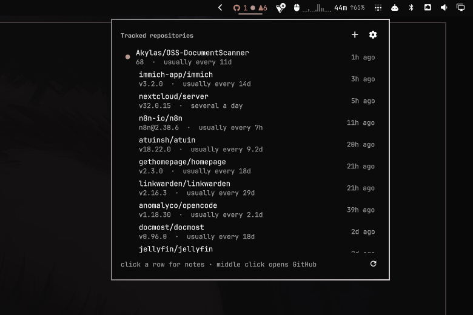

# GitHub Release Monitor



An Omarchy bar widget that watches the projects you depend on and tells you
when one ships — or when one has gone quiet for longer than it usually does.

```
 19          nothing new
 3 ●         releases in the last day
 19 ⚠2       repositories past their own release cadence
```

Click for the list and the release notes. Middle click polls now.

## Settings

The cog in the panel header. Four toggles — count prereleases, warn when a
project goes quiet, show the number, notify on a new release — and a slider
for how far past its own rhythm a project goes before it is called overdue.

Changes are written to the widget's entry in `shell.json`, the same place
`omarchy bar set` writes and the daemon reads, and take effect on the poll
that fires immediately after:

```bash
omarchy bar set io.github.irhop.github-monitor overdueFactor 2.0
```

Per-repository choices — prereleases, and silencing the overdue warning for
one project — live in that repository's notes view, not here.

## What clicks do

In the bar:

| | |
| --- | --- |
| left click | open the list |
| middle click | poll the feeds now |

In the list:

| | |
| --- | --- |
| left click | release notes for that repository |
| middle click | open the release on GitHub |
| right click | copy the release link |

In the notes view, four buttons: open the release, open the repository, copy
the tag, copy the release link.

There is deliberately no "copy the install command". A release feed says what
shipped, not how a project is installed — immich is a compose file, atuin a
shell script, syncthing a distro package. A guessed command would look
authoritative and be wrong. The tag and the links are what the feed actually
knows.

## No GitHub account required

Polling reads each repository's `releases.atom` feed, which is the web
endpoint rather than the REST API. That means no token, no login, and nothing
counted against the API's 60-requests-per-hour unauthenticated budget.
Nineteen repositories take about two seconds, and unchanged feeds answer
`304 Not Modified`.

If a token happens to be present — `GITHUB_TOKEN`, `GH_TOKEN`, or `gh auth
token` — it is used to raise the search allowance from ten requests a minute
to thirty. Polling never needs one. Nothing prompts you for a token, and none
is ever stored.

## The dot means unseen

Not "released recently". A release you have looked at stops being news, so the
dot clears when you close the panel rather than when a timer runs out. Nothing
is unseen on the first poll — otherwise installing this would greet you with
nineteen notifications.

## Stable or prereleases

Stable only, by default: `-rc`, `-beta`, `-alpha` and `v35.0.0rc4` are read as
prereleases and skipped. Turn them on everywhere with **Count prereleases** in
the widget's settings, or decide per repository — which is usually what you
want, since following one project's release candidates rarely means following
everyone's:

```bash
omarchy-github-monitor pre nextcloud/server            # follow prereleases here
omarchy-github-monitor pre nextcloud/server --off      # stable only here
omarchy-github-monitor pre nextcloud/server --default  # follow the global setting
```

The flask button in the notes view does the same thing. A per-repository
choice wins over the global setting in both directions, and is stored on the
line in `repos.txt` as `+pre` or `-pre`.

Changing it re-fetches that repository rather than re-filtering what was
cached: which release counts as the latest depends on the answer, and the feed
body is not kept.

A row showing a prerelease says so, in the list and in the notes.

## Overdue

The feature no feed reader gives you. Each repository's own average gap
between releases is computed from its last ten, and one that has gone longer
than 1.5× that gap gets the warning. A project with fewer than three releases
has no established rhythm, so it is never marked overdue.

Tune the multiplier in the widget's settings.

Some projects ship in bursts and will never look regular. Mute those rather
than letting the warning lose its meaning — the bell in the notes view, or:

```bash
omarchy-github-monitor mute Akylas/OSS-DocumentScanner
omarchy-github-monitor mute --unmute Akylas/OSS-DocumentScanner
```

Muting appends `!overdue` to that line in `repos.txt`. The repository is still
tracked and still reports releases; it just never warns.

## Install

```bash
omarchy plugin add https://github.com/irhop/omarchy-github-monitor.git
```

It lands disabled, which is the point: plugins run unsandboxed inside
`omarchy-shell`, so read the code before enabling anything. When you are
satisfied:

```bash
~/.config/omarchy/plugins/io.github.irhop.github-monitor/install.sh
```

That enables the widget and installs the poll timer. Enabling the plugin on
its own installs nothing — you get a widget that reads a file. To see exactly
what the timer setup would do first:

```bash
~/.config/omarchy/plugins/io.github.irhop.github-monitor/bin/omarchy-github-monitor bootstrap --dry-run
```

## Removing it

```bash
# Stop and remove the poll timer
systemctl --user disable --now omarchy-github-monitor.timer
rm -f ~/.config/systemd/user/omarchy-github-monitor.{timer,service}
systemctl --user daemon-reload

# Take the widget off the bar and delete the plugin
omarchy plugin remove io.github.irhop.github-monitor

# Your tracked list and poll history, if you want them gone too
rm -rf ~/.config/omarchy-github-monitor ~/.local/state/omarchy-github-monitor
```

The plugin's entry in `~/.config/omarchy/shell.json` goes with `omarchy plugin
remove`. Nothing else on the system is touched, so those four steps remove it
completely.

## Dependencies

Python 3 and the standard library, and nothing else required — no pip
packages, no `requests`.

Everything below is optional and only used by the feature named beside it. The
plugin works without all of them.

| | |
| --- | --- |
| `wl-copy` (wl-clipboard) | the copy buttons |
| `xdg-open` | opening a release in your browser |
| `omarchy-notification-send` | notifications, falling back to `notify-send` |
| `systemd` (user session) | the poll timer |
| `pacman`, `mise`, `docker` | `installed`, each used only if present |

## What it runs

Plugins are unsandboxed, so here is the whole list of what this one executes
and touches. Nothing here needs root.

| | |
| --- | --- |
| network | `https://github.com/OWNER/REPO/releases.atom` for tracked repositories; `api.github.com` only when you search or ask for `status` |
| writes | `~/.config/omarchy-github-monitor/repos.txt`, `~/.local/state/omarchy-github-monitor/state.json`, and its own entry in `~/.config/omarchy/shell.json` |
| runs | `wl-copy` (copy buttons), `xdg-open` (open on GitHub), `omarchy-notification-send`, `systemctl --user` (timer setup only), and for `installed`: `pacman -Qi`, `mise`, `docker` |
| never | asks for, stores, or transmits a GitHub token; a token in your environment is used only to raise the search allowance |

### How it runs those commands

None of them is looked up on `PATH`. Each is resolved once against a fixed list
of directories — `/usr/local/bin`, `/usr/bin`, `/bin`, `/usr/share/omarchy/bin`,
and mise's shim directory, which is the only place `gh` exists on a mise install
— and then called by absolute path. A tool found nowhere in that list counts as
not installed, and the feature that wanted it is skipped rather than falling
back to whatever `PATH` offers. The poll timer sets its own `PATH`, the widget
and panel clear the environment they inherit from the compositor, and
`install.sh` names `/usr/bin/systemctl` and `/usr/share/omarchy/bin/omarchy`
outright.

Every child process has a deadline. On expiry it gets `SIGTERM` and then
`SIGKILL`, and in the helper the signal goes to the whole process group, so a
`docker --context` that opened an SSH connection to an unreachable host leaves
nothing behind. Output is read from temporary files with a 16 MiB ceiling per
stream rather than from pipes, so a tool that streams without end cannot grow
the plugin's memory.

Both state files are written to an unpredictably named temporary file in the
target's own directory, created `O_EXCL` and `0600`, and then moved into place
with `rename(2)`. Nothing pre-existing at the target path is followed or
written through, including a symlink. The two systemd unit files are written
the same way.

## Tracked repositories

One `owner/repo` per line in `~/.config/omarchy-github-monitor/repos.txt`.
Edit it directly, or:

```bash
omarchy-github-monitor list
omarchy-github-monitor add immich-app/immich
omarchy-github-monitor add https://github.com/immich-app/immich  # URLs work
omarchy-github-monitor remove immich-app/immich
omarchy-github-monitor search paperless                          # then add one
omarchy-github-monitor status                                    # limits, auth
```

`add` checks the feed before writing, so a typo fails immediately instead of
becoming a row that is empty for reasons nobody remembers.

`search` is the only part that touches the REST API. It has its own budget —
ten requests a minute, unauthenticated — so it runs when you press Enter, not
as you type. GitHub's qualifiers work: `topic:selfhosted stars:>1000`.

## What have you actually got installed?

A release matters when you are behind it, not when it exists.

```bash
omarchy-github-monitor installed             # this machine and every Docker context
omarchy-github-monitor installed homelab     # one host
omarchy-github-monitor installed --remote-only
```

```
  Tracked repositories you have installed

  anomalyco/opencode   released v1.18.30   installed 1.18.25    mise      ▲ behind
  atuinsh/atuin        released v18.22.0   installed 18.21.0    pacman    ▲ behind
  jellyfin/jellyfin    released v12.0      installed 10.11.11   homelab   ▲ behind

  Running but not tracked

  vaultwarden    vaultwarden/server:latest    homelab   add dani-garcia/vaultwarden
```

Rows that are behind come first. Three sources, none of them guessing at
names: `pacman -Qi` reports each package's declared upstream URL, `mise
registry` maps a tool to its backend repository, and Docker containers carry
the OCI source label.

### Your own servers

There is no host list to configure. It reads `docker context ls`, so every
host you already reach with the Docker CLI is included, the local socket
among them. If you have no contexts yet, one line adds a server you can
already SSH into:

```bash
docker context create homelab --docker host=ssh://you@homelab
omarchy-github-monitor installed
```

That is the same mechanism `docker --context` uses, so nothing here is
specific to this plugin and nothing new has to be kept in sync.

A host that needs an interactive check — Tailscale SSH does, by default, on
every new connection — will hit the timeout and be reported as unreachable
rather than hanging. Raising `checkPeriod` in the tailnet policy makes those
hosts answer without a browser round trip.

### When a version cannot be read

`unknown` is not a failure, it is the honest answer for an image whose tag is
a pointer (`latest`, `stable`) and which publishes no
`org.opencontainers.image.version` label. It is never reported as `current`.

When the automatic matching cannot connect a container to a repository you
track, pin it in `repos.txt`:

```
dani-garcia/vaultwarden @vaultwarden/server
``` Deliberately a command you run rather than part of the poll: a
context on a Tailscale SSH endpoint can block on an interactive check, and a
timer that stalls on a browser prompt nobody sees is worse than no feature.
Every host call carries a timeout and an unreachable host says so.

**Matching** is the OCI `org.opencontainers.image.source` label first, then
the image path. There is no fuzzy match on the project name — that paired
`vaultwarden/server` with `nextcloud/server` and reported a service that was
not running at all as out of date. When neither works, pin it in `repos.txt`:

```
dani-garcia/vaultwarden @vaultwarden/server
```

**Versions** come from the `org.opencontainers.image.version` label, or a tag
that looks like a version. A `latest` tag with no label reports `unknown` —
never `current`, because a pointer tag cannot tell you what it points at.

## Keybindings

Omarchy has no free `SUPER + G` (window grouping) or `SUPER + SHIFT + G`
(Signal), so:

```lua
o.bind("SUPER + ALT + R", "GitHub releases", "omarchy-shell github-monitor toggle")
o.bind("SUPER + ALT + SHIFT + R", "Track a GitHub repository", "omarchy-shell github-monitor add")
```

Other IPC routes: `poll`, `open`, `close`, `settings`, `show <owner/repo>`.

## How it fits together

```
systemd timer ─▶ bin/omarchy-github-monitor fetch
                        │
                        ▼
       ~/.local/state/omarchy-github-monitor/state.json
                        │
                        ▼
              BarWidget.qml ─▶ Panel.qml
```

The daemon and the widget share nothing but that file. The widget makes no
network requests; the daemon draws nothing.

Release notes are third-party text, so the daemon flattens the HTML to plain
text and the panel renders it as plain text, never rich text.

## Development

```bash
./test_github_monitor.py      # no network, no framework
omarchy plugin validate .
```

Saving any file under `~/.config/omarchy/plugins/` reloads the shell's plugin
code. Changes to `manifest.json` defaults need `omarchy restart shell`.

## License

MIT
